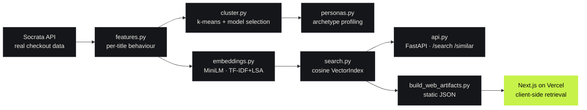

<div align="center">



<br/>

<p>
  <a href="https://library-circulation-intelligence.vercel.app">
    
  </a>
  <a href="https://github.com/AyushDas4890/Library-book-classifier/actions/workflows/ci.yml">
    
  </a>
  
</p>

<p>
  
  
  
  
  
</p>

<h3>Unsupervised segmentation <em>and</em> semantic retrieval over real public-library open data.</h3>

<sub>Two questions, one reproducible pipeline — built end to end on the Seattle Public Library<br/><b>“Checkouts by Title”</b> open dataset. No synthetic data. No inflated metrics.</sub>

<br/><br/>

**[✦ Open the live experience →](https://library-circulation-intelligence.vercel.app)**

</div>

---

<div align="center">

|  |  |
| :-- | :-- |
| **How do titles circulate?** | k-means groups ~21k titles into six **circulation archetypes** — steady staples, bursty / event-driven, enduring backlist, digital-first… |
| **Can we search by meaning?** | Every title is embedded into a vector space, so a free-text query is matched by cosine similarity — the **retrieval core of a RAG system**, running fully client-side. |

</div>

---

### ✦ At a glance

<table>
<tr>
<td align="center"><b>119,243</b><br/><sub>distinct titles</sub></td>
<td align="center"><b>21,012</b><br/><sub>modelled titles</sub></td>
<td align="center"><b>6</b><br/><sub>archetypes (k)</sub></td>
<td align="center"><b>0.42</b><br/><sub>silhouette</sub></td>
<td align="center"><b>0.82</b><br/><sub>davies–bouldin</sub></td>
<td align="center"><b>9,536</b><br/><sub>calinski–harabasz</sub></td>
</tr>
</table>

> `k` is chosen by scanning **k = 2…10** and taking the peak silhouette on a fixed evaluation sample — reported in full, no forcing, no metric computed on a hand-picked subset and sold as the headline.

---

### ✦ Architecture



---

<details>
<summary><b>✦ Quickstart</b></summary>

<br/>

```bash
# 1 — install the package + dev tools
pip install -e ".[dev]"

# 2 — run the test suite (9 tests) and lint
pytest -q && ruff check src tests

# 3 — build clusters + embeddings from the committed real sample
python -m library_intel.pipeline

# 4 — serve the retrieval API
uvicorn library_intel.api:app --reload      # http://localhost:8000/docs
```

Web app:

```bash
python scripts/build_web_artifacts.py        # refresh web/public/data
cd web && npm install && npm run dev          # http://localhost:3000
```

Pull fresh data from the live API instead of the committed sample:

```bash
python -m library_intel.pipeline --refresh
```

</details>

<details>
<summary><b>✦ How it works (the honest version)</b></summary>

<br/>

**Segmentation.** A “book” = `(normalized title, normalized creator)`. For each we engineer eight standardized
behavioural features — overall demand, monthly intensity, months active, volatility, demand concentration,
digital share, title age, subject breadth. k-means runs over those, with `k` selected by silhouette across the
full search range. Metrics are computed on the full model space at the chosen `k`.

**Interpretation.** Cluster names are derived from each centroid’s single strongest standardized deviation — a
transparent reading aid, **not** a validated taxonomy.

**Retrieval (RAG core).** Each title is turned into a short document (`title · creator · subjects`) and embedded.
The query is embedded into the *same* space and matched by cosine similarity.
- The **FastAPI service** uses dense MiniLM (`all-MiniLM-L6-v2`) embeddings.
- The **web demo** ships a TF-IDF + LSA encoder so the browser can embed a query and run cosine retrieval with
  **zero backend and no API key**.

</details>

<details>
<summary><b>✦ Repository layout</b></summary>

<br/>

```
src/library_intel/   data · features · cluster · personas · embeddings · search · api · pipeline
tests/               pytest suite (features, clustering, retrieval)
scripts/             build_web_artifacts.py
data/sample/         committed real slice for offline reproduction
artifacts/           metrics.json + (gitignored) model & vectors
web/                 Next.js 14 app — dark UI, scroll motion, client-side search
.github/workflows/   CI: ruff + pytest, and a Next.js build
```

</details>

<details>
<summary><b>✦ Limitations &amp; roadmap</b></summary>

<br/>

- **Sample, not the full corpus.** The committed run uses 120k of the ~2.3M 2023 rows for fast, reproducible
  builds. `--refresh` pulls live.
- **Labels are interpretive,** derived from centroid deviations — not a validated taxonomy.
- **Clustering is behavioural,** describing *how* a title circulates, not what it’s about. The embedding index is
  the semantic half.
- **Next:** approximate-NN index (FAISS / HNSW) for full-catalogue retrieval, an embedding recommender evaluated
  against held-out co-checkout pairs, and a logged hyper-parameter sweep.

</details>

---

<div align="center">

### Built by **Ayush Das** — clustering + RAG over public-library open data.

<a href="https://library-circulation-intelligence.vercel.app"><b>Live demo</b></a> &nbsp;·&nbsp;
<a href="https://github.com/AyushDas4890/Library-book-classifier"><b>Source</b></a> &nbsp;·&nbsp;
<sub>Data © Seattle Public Library open data · code under MIT</sub>

</div>
